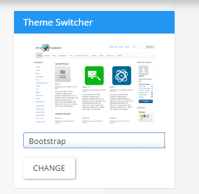

# Theme Switcher


##### In maincore.php change set_theme() to
```php
$theme = !empty($_COOKIE[COOKIE_PREFIX.'theme']) ? $_COOKIE[COOKIE_PREFIX.'theme'] : (empty($userdata['user_theme']) ? fusion_get_settings('theme') : $userdata['user_theme']);
set_theme($theme);
```


